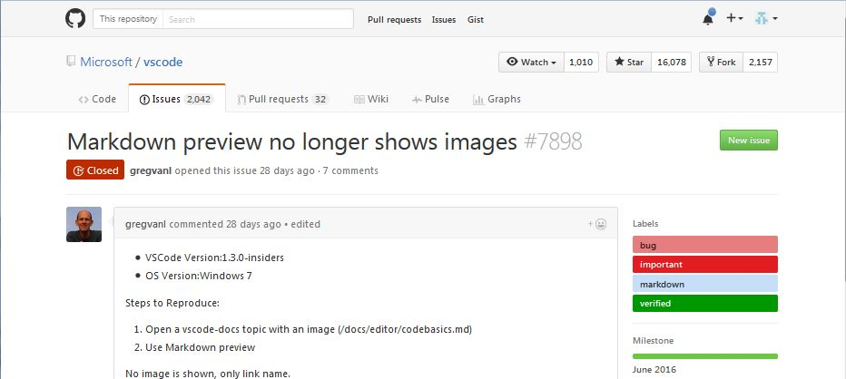

# Absolute path
1. `C:/temp/TestVscode-7898/markdown/screenshots/pic.jpg`  

1. `C:/temp/TestVscode-7898/markdown/screenshots/pic one.jpg`  

1. `C:\temp\TestVscode-7898\markdown\screenshots\pic.jpg`  

1. `C:\temp\TestVscode-7898\markdown\screenshots\pic one.jpg`  

# Relative to workspace
1. `markdown/screenshots/pic.jpg`  

1. `markdown/screenshots/pic one.jpg`  

1. `markdown\screenshots\pic.jpg`  

1. `markdown\screenshots\pic one.jpg`  

# Relative to markdown
1. `screenshots/pic.jpg`  

1. `screenshots/pic one.jpg`  

1. `screenshots\pic.jpg`  

1. `screenshots\pic one.jpg`  
